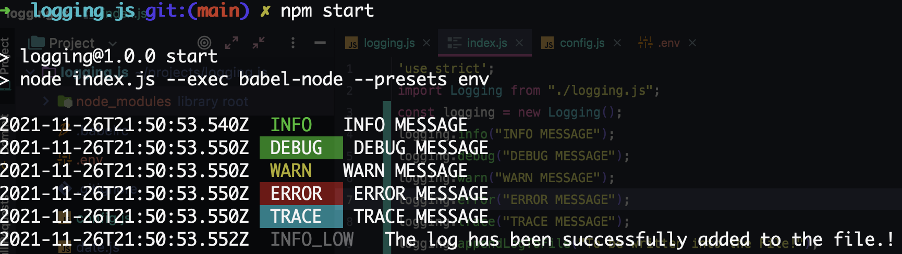
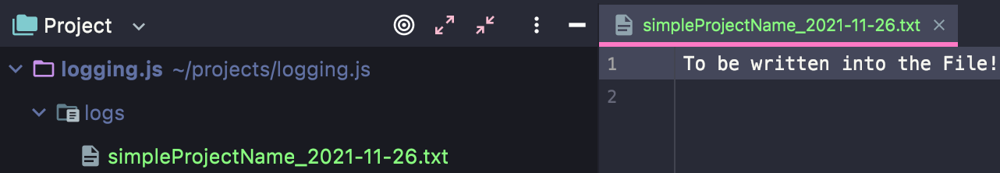

## Quick Start

```js

const logging import "@asince_npm/logging/index.js";
logging.info("to be written into the console!");

/**
 * According to the LOGGING_FILE_PATH and LOGGING_FILE_NAME_PREV values in the .env file,
 * the name of the folder and file where the logging will occur is created. The full name of the file is created 
 * according to the parameter and timestamp value from the .env file.
 * @param message to be written into the file.
 */
logging.appendLogToFile(message);
```
## .env
````dotenv
LOGGING_FILE_PATH=./logs
LOGGING_FILE_NAME_PREV=simpleProjectName
````

## Result
- logs/simpleProjectName_2021-11-26.txt

## Import Package
- You can simply run the script.sh script, which downloads the babel npm packages for ECMAScript6 and creates 
the .babelrc file. It also downloads the dotenv package.

## Samples
  
  

